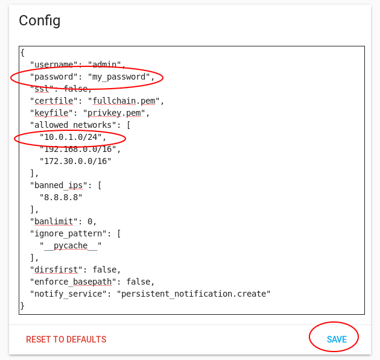

# Inventory
Please take a moment to check that you have all the workshop pieces:
- 24V Power Supply
- Orange Pi Prime with microSD card and interface board
- 1M Ethernet cable
- Relay module
- 433MHz radio modules
- 2 x 433MHz Antennas
- SWD Programmer (looks like a USB stick)
- 16 Channel OneWire SSR/Switch board

Before plugging in, please inspect your Orange Pi Prime. Ensure that the Wifi cable is not inside the board (if it is, carefully
remove the interface board, disconnect the Wifi cable & reroute it outside) and that the heatsink is not loose.

# Errata
- The +3.3V line on the interface board for GPIO headers is actually +5V, but if the relay signal is 3.3V while relay
power is 5V, the signal always reads low. To work around this, power the relay from the 3.3V line instead.
- The pushbutton is connected to PC5, which does not have an associated IRQ. We use a jumper to short it to PA6 instead.

# Disclaimer
This workshop includes a cheap relay module which in nominally rated for mains control. It is included for demonstration purposes
only. If you intend to control hardwired mains devices, please talk to an electrician about suitable switchgear.

# Set up Home Assistant
- Identify the IP address of your Orange Pi Prime. Use the number written on the ethernet port of your device to look up the IP address in infrastructure/dhcpd.conf
- Point a web browser at http://#orange pi IP#:8123. You should be greeted with the Home Assistant user creation screen

- Create your account, then log in with the account you just created

# Configure Home Assistant
To make life easier, lets first enable a few plugins to allow us to configure Home Assistant

## Install Configurator
- Click on the hamburger icon in the top left to expand the menu

- Click on Hass.io, then Addon Store
- Select the Configurator addon (under Official Addons), then click "Install". This addon allows you to edit the system configuration through a web interface.
- Once installed, add a password to the config, don't forget to wrap in it quotes. If you run a different IP range at home to the ones preconfigured, take the opportunity to add that too. Press save in the bottom right to save your changes.

- Finally hit "Start" to start the addon. You can view any log messages from the addon by clicking "refresh" in the log panel.

## Install OWFS->MQTT Gateway
You don't need to install this anymore, it's been seeded in the image:
- In a new tab, navigate to the Addon Store, click the refresh button in the top right, you should see a "Local Addons" section appear
- Click on the OWFS->MQTT Bridge
- Click Install

## Initial Home Assistant Configuration
- Back in your original tab, click on "Open Web UI" on the Configurator Addon. This will open the editor in a new tab.

- In the editor, click on the folder icon in the top left, and navigate to `configuration.yaml`
- Remove the `introduction` section
- Configure your latitude and longitude for your home. If you don't know this, then you can look it up using [Google Maps](https://maps.google.com). Search for your address,
right click on the selection pin, and choose "What's Here?" from the menu. A dialog will open at the bottom of the window with the location information.
You may not be able to copy/paste this, so you'll have to type it in.
- Configure the altitude for your home address. If you don't know this, you can estimate it using [Free Map Tools](https://www.freemaptools.com/elevation-finder.htm)
- Configure your time zone, you can get a list of zones on [Wikipedia](https://en.wikipedia.org/wiki/List_of_tz_database_time_zones)
- Click on the red save icon at the top of the window to save your changes
- Switch back to you Home Assistant tab and select "Configuration" from the hamburger menu

- Click on "General", then "Check Config". If everything is good, click on "Reload Core"


## Patch GPIO code for the Orange Pi
This step will not be necessary once [Mikal Still's GPIO patches](https://github.com/home-assistant/home-assistant/pull/19732) have been merged.

- In the Addon Store, under Community Hass.IO Addons, install "SSH and Web Terminal"
- The SSH daemon authenticates via your public key. If you don't have one generated already, build one new with `ssh-keygen`
- Copy you SSH public key into your clipboard: `cat ~/.ssh/id_rsa.pub` (then copy the output)
- Add your SSH key to the "authorized_keys" list, and disable the web interface (since you can SSH in directly from your laptop).

- Disable the Protection Mode option on the addon

- Start the Addon, this takes a little while, you can monitor progress by refreshing the log panel. The server is running when you see
`Server listening on 0.0.0.0 port 22` in the logs
- SSH into the machine `ssh hassio@#orange pi IP#`
- Get a shell in the docker instance of Home Assistant `docker exec -it homeassistant bash`
```
cd /tmp
wget https://raw.githubusercontent.com/InfernoEmbedded/HomeAutomationWorkshop/master/patches/homeassistant-gpio-opi.patch
cd /usr/local/lib/python3.6/site-packages/
patch -p 1 </tmp/homeassistant-gpio-opi.patch
rm /tmp/homeassistant-gpio-opi.patch
pip install OPi.GPIO
exit
```
- You should now be back in the SSH session's shell. The following command will make the patch you just made permanent (at least until you upgrade Home Assistant
`docker commit homeassistant homeassistant/orangepi-prime-homeassistant`
- Restart HomeAssistant by clicking on Menu, Configuration, General, Restart

# Playing with GPIO
I made a mistake when laying out the PCB and connected the pushbutton to a pin that does not have interrupts (PC5). This means that
while you can explicitly read the state of the pin, you can't trigger events from it. An adjacent pin does have interrupts, so
you will find a a jumper connecting pins PC5 (pin 8 on the header) with PA6 (pin 7 on the header). If you need to use these pins
for other purposes later, you will need to remove the jumper, which will disconnect the switch from PA6 (but it will still be
connected to PC5).

## Enable GPIO
- Using the Configurator addon we used previously, edit `configuration.yaml` and add the following section:
```
rpi_gpio:
  board_family: orange_pi

switch:
 - platform: rpi_gpio
   ports:
     PC8: Relay1

binary_sensor:
 - platform: rpi_gpio
   invert_logic: true
   ports:
     PA6: Pushbutton
```
- Check on your OWFS->MQTT Gateway install, if it's still going, wait here before you restart Home Assistant.
- Save your changes, check the configuration then restart Home Assistant
- You should now see Relay1 in the list of devices in the overview, and Pushbutton as a sensor at the top of the overview.

## Connect the Relay
- The pinout on the interface board differs from the relay board, so you'll need to make an adjustment to your cable.
Using a pin or other pointy object, carefully lift the locking tabs and remove the red and black wires on one end of the cable. Leave the red wire loose, and connect the black wire where the red wire was (this may have already been done for you).


- Remove power from your machine
- Plug the unaltered connector into the relay module, using black for ground.
- Plug the end with the yellow & black pair into PC8 on the GPIO header.
- Finally, plug the red wire into pin 2 on the Pi header (+3.3V) (bottom left, when the header is facing you)

- Plug your machine back in after checking carefully that you have the correct pin.

## Control your devices
- Looking at the Overview page, press the button on the interface board. You should see the Pushbutton icon at the top of page
change state.
- Click on the icon for Relay1, your relay should switch on and off.

## Enable NodeRed
NodeRed provides a graphical flow-based interface, which makes it easy to create complex automations. In this example, we will toggle the relay you connected earlier with the pushbutton on the interface board.

- Install NodeRed from the Community Addons
- Set "credential secret" in the NodeRed config, this is used to encrypt locally stored data
- Also disable SSL for now, since we have not obtained an SSL certificate
- Save your changes, then start NodeRed
- Open the Web UI, and log in with your Home Assistant credentials
- Double click on the tab name "Flow 1" and rename it to "Relay Control"
- Drag a Home Assistant "Events: State" node from the toolbox on the left to the left side of your flow
- Double click on the new node, we will configure it to read state changes from the pushbutton
- Name the node 'Pushbutton'
- Now enter "binary_sensor.pushbutton" in the Entity ID. Note that this field autopopulates, so you can quickly drill down to the
right entity.
- Change the Entity Match Type to exact
- Click on Done

You now have a node in your flow that generates messages whenever the button is pressed, let's investigate...
- Drag an Output "Debug" node to the right of your Pushbutton node
- Click and drag on the connection points between the 2 nodes to connect them

- Click on the red Deploy button in the top right to deploy your flow
- Click on the Hamburger menu in the top right, then select View, Debug Messages
- Press your button, you should a message come out each time the button changes state
- Double click the debug node, then change output to "complete msg object"
- Deploy your changes and press the button, you should now see more information about the message

Now let's connect you relay into the flow.
- Drag a Home Assistant "Call Service" node into the flow and configure it:
    - Name: Relay
    - Domain: switch
    - Service: toggle
    - Entity ID: switch.relay1
    - Click Done
- Connect your Relay node to the output of the Pushbutton node
- Deploy your flow

If everything has gone as planned, your relay should change state every time the button is pressed or released. You can also change
the state of the relay by clicking on it's icon in the Home Assistant overview screen.

This behaviour is great if you are using a latching/toggle switch, but since we have a momentary switch, it's a bit awkward. Let's
change this so we only issue a toggle if the button is pressed.
- Double click on the Pushbutton Node
- In the "Halt if State" section, select "=", "off". This will halt the flow if msg.payload is "off"
- Deploy your flow and play with your button

# Playing with 1Wire
1Wire is a protocol from Dallas Semiconductors (now Maxim), designed for low speed communications over medium distances. It is commonly
used in home automation for temperature sensing, but since the protocol is relatively simple, I have implemented it in software to
allow for wired control of many aspects of home automation. I currently have open source designs available for switches (inputs),
relays (outputs), air conditioning zone control and RGBW LED strips.

In this section, you will configure a gateway to bridge 1Wire devices into Home Assistant, then program an STM32 microcontroller so
that it enumerates on the 1wire bus and provides remote switching & input capabilities.

## Enable Mosquitto
We will be using MQTT to interact with Home Assistant. While Home Assistant includes a cut-down MQTT broker, Mosquitto
is more powerful, and has a couple of features that we requires.
- Create a new user for MQTT interactions with One Wire devices (the Mosquitto Addon inherits the Home Assistant users). Go to Configuration, Users,
then click on the yellow '+' at the bottom right to create a new user. Use "OneWire" as the name, and 'owfs' as the username. Select a password
(you'll need it later, so remember it or store it in a password safe), then create the user.
- Install the Mosquitto Addon under Official Addons
- Start the Mosquitto Addon
- Go back to the Overview page, you should see a 'New Devices Discovered' panel, follow the "check it out" link (if not, navigate to /config/integrations)
- Click Configure next to MQTT, then select 'Enable Discovery'

## Configure the Gateway
- Navigate to the OWFS->MQTT Gateway page under HassIO (it should be installed by now)
- enter the username and password for owfs that you created earlier
- Start the service
- Go back to your Overview, along the top, you should see a temperature reading, with a device name of "temperature_28.xxxxxx", this is the 1Wire temperature probe on the interface board, located behind the 1Wire RJ45 socket.
- To name the device, go to Configuration, Customization, then select your temperature sensor
- Click the pen next to the name and you can edit this. Call it "OPi Ambient". Ignore the warning that says `It seems that your configuration.yaml doesn't properly include customize.yaml`, I believe it is bogus
- Go back to the overview and the temperature sensor should now have a meaningful name

## Program your 16 Channel SSR board
Included in your kit is a 1Wire board with 16 GPIO brought out to a header. These are configured as 8 ports of 2 channels. The schematics and code are in the onewire-softdevice/devices/16_Channel_SSR_Driver. 

Each channel pair can be configured either as an pair of outputs, a tandem pair of outputs for devices like roller shutters that require
one relay to open and another to close, a pair of inputs with internal pullup/pulldown resistors with either momentary or toggle
switches connected. The default firmware uses the 3 solder jumpers to determine how many ports to use as inputs (the rest will be
outputs). Since this workshop does not involve soldering, we will instead patch around this to set the number of inputs in firmware.

- On your laptop, edit `onewire-softdevice/devices/16_Channel_SSR_Driver/src/main.cpp` in your favorite editor.
- Scroll to the bottom of the file (in main()) and find the following code:
```
    if (inputPortCount) {
        TRACE("Binding ports %d-%d as inputs", NUM_PORTS - inputPortCount, NUM_PORTS - 1);
    }
```
- Just before the if statement, force inputPortCount to 4, this will give you 4 output ports (ports 0-3) and 4 input ports (ports 4-7):
```
    inputPortCount = 4;
```
- Save & exit your editor
- Build your firmware: `./build.sh`
- Connect your programmer to the board using the supplied jumper cables. The pinout for the programming header on the board is on the underside (the labels are directly below the pins):
    - Programmer SWCLK to SWCLK
    - Programmer SWDIO to SWDAT
    - Programmer Gnd to Gnd
    - Programmer 3.3V to +3.3V
- Plug the programmer into a USB port
- flash your edited firmware `sudo ./flash.sh`

## Connect the relay to the SSR board
- Disconnect the relay from the interface board
- Using a pin or other small tool, gently lift the locking tab and free the black wire from the connector.
- Plug the black wire into a Gnd pin on the the SSR board (Top row of the IO header)
- Plug the yellow wire into Port 0 Channel 0 on the SSR board (bottom row of the IO header)
- Plug the red wire into the 3.3V pin (pin 1) on the programming header


## Bring your SSR board into Home Assistant
- Using the supplied CAT5 cable, connect one of the daisy chain ports on your SSR board to the 1Wire port on the interface board
- HomeAssistant should automatically recognise the device and create button and switch entities for it

- Try toggling the relay (relay_foo_0_0), what do you observe?

This relay module uses an active low signal, so the indicator LED is inverted (this is due to the use of a transistor to control
the switching current through the relay). We accounted for this in the GPIO configuration by inverting the pin definition when we
configured Home Assistant. We do not have that ability with MQTT devices, however, it is not too much of a problem, as the relay
has 2 outputs, normally open (which closes when the relay is energised) and normally closed (which opens when the relay is energised),
so we have an output which is inverted for use. Solid State Relays do not have this problem, they are active high, they put
less load on the board, and they have no moving parts, so if you are connecting more than a couple of devices, they are a better choice.

Ports 0-3 on the board are exposed as the relay entities in Home Assistant, while ports 4-7 are exposed as buttons. If you liberate
the jumper from pins 7-8 on the IO board, you can use it to short one of the button pins to ground, which will send a brief blip of
that button to Home Assistant. The board understands the type of switch connected to it (defaults to momentary), and will register a
switch activation based on the type of switch. (Todo: This needs to be implemented in the MQTT gateway so that a retained topic will
permanently configure board if it is power cycled)

## Make it useful
- Using what you have learnt so far, create a Node Red flow that can listen to multiple switches and toggle the relay accordingly.
- For bonus points, imagine you have a motion sensor connected to one of the inputs. Alter your flow such that the motion sensor turns
on the relay for some time, while the switches continue to toggle the state. Make sure you handle the case where the motion sensor
turned on the light, but a user turned it off.
