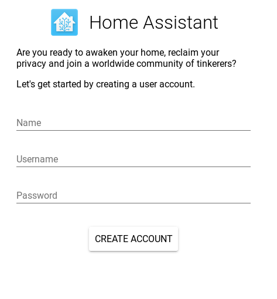

# Set up Home Assistant
- Identify the IP address of your Orange Pi Prime. Use the number written on the ethernet port of your device to look up the IP address in infrastructure/dhcpd.conf
- Point a web browser at http://#orange pi IP#:8123. You should be greeted with the Home Assistant user creation screen

- Create your account, then log in with the account you just created

# Configure Home Assistant
To make life easier, lets first enable a few plugins to allow us to configure Home Assistant

## Install Configurator
- Click on the hamburger icon in the top left to expand the menu

- Click on Hass.io, then Addon Store
- Select the Configurator addon (under Official Addons), then click "Install". This addon allows you to edit the system configuration through a web interface.
- Once installed, add a password to the config, don't forget to wrap in it quotes. If you run a different IP range at home to the ones preconfigured, take the opportunity to add that too. Press save in the bottom right to save your changes.

- Finally hit "Start" to start the addon. You can view any log messages from the addon by clicking "refresh" in the log panel.

## Initial Home Assistant Configuration
- Click on "Open Web UI" on the Configurator Addon. This will open the editor in a new tab.

- In the editor, click on the folder icon in the top left, and navigate to `configuration.yaml`
- Remove the `introduction` section
- Configure your latitude and longitude for your home. If you don't know this, then you can look it up using [Google Maps](https://maps.google.com). Search for your address,
right click on the selection pin, and choose "What's Here?" from the menu. A dialog will open at the bottom of the window with the location information.
You may not be able to copy/paste this, so you'll have to type it in.
- Configure the altitude for your home address. If you don't know this, you can estimate it using [Free Map Tools](https://www.freemaptools.com/elevation-finder.htm)
- Configure your time zone, you can get a list of zones on [Wikipedia](https://en.wikipedia.org/wiki/List_of_tz_database_time_zones)
- Click on the red save icon at the top of the window to save your changes
- Switch back to you Home Assistant tab and select "Configuration" from the hamburger menu

- Click on "General", then "Check Config". If everything is good, click on "Reload Core"


## Patch GPIO code for the Orange Pi
This step will not be necessary one [Mikal Still's GPIO patches](https://github.com/home-assistant/home-assistant/pull/19732) have been merged.

- In the Addon Store, under Community Hass.IO Addons, install "SSH and Web Terminal"
- The SSH daemon authenticates via your public key. If you don't have one generated already, build one new with `ssh-keygen`
- Copy you SSH public key into your clipboard: `cat ~/.ssh/id_rsa.pub` (then copy the output)
- Add your SSH key to the "authorized_keys" list, and disable the web interface (since you can SSH in directly from your laptop).

- Disable the Protection Mode option on the addon

- Start the Addon, this takes a little while, you can monitor progress by refreshing the log panel. The server is running when you see
`Server listening on 0.0.0.0 port 22` in the logs
- SSH into the machine `ssh hassio@#orange pi IP#`
- Get a shell in the docker instance of Home Assistant `docker exec -it homeassisant bash`
```
cd /tmp
wget https://raw.githubusercontent.com/InfernoEmbedded/HomeAutomationWorkshop/master/patches/homeassistant-gpio-opi.patch
cd /usr/local/lib/python3.6/site-packages/
patch -p 1 </tmp/homeassistant-gpio-opi.patch
rm /tmp/homeassistant-gpio-opi.patch
pip install OPi.GPIO
exit
```
- You should now be back in the SSH session's shell. The following command will make the patch you just made permanent (at least until you upgrade Home Assistant
`docker commit homeassistant homeassistant/orangepi-prime-homeassistant`
- Restart HomeAssistant by clicking on Menu, Configuration, General, Restart

## Enable Orange Pi GPIO
- Using the Configurator addon we used previously, edit `configuration.yaml` and add the following section:
```
rpi_gpio:
  board_family: orange_pi

switch:
 - platform: rpi_gpio
   ports:
     PC8: Relay1

binary_sensor:
 - platform: rpi_gpio
   invert_logic: true
   ports:
     PC5: Pushbutton
```
- Save your changes and check the configuration
- Reboot the machine by SSHing in and typing `reboot`